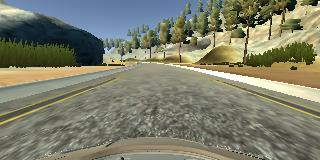
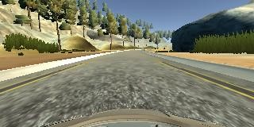
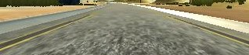
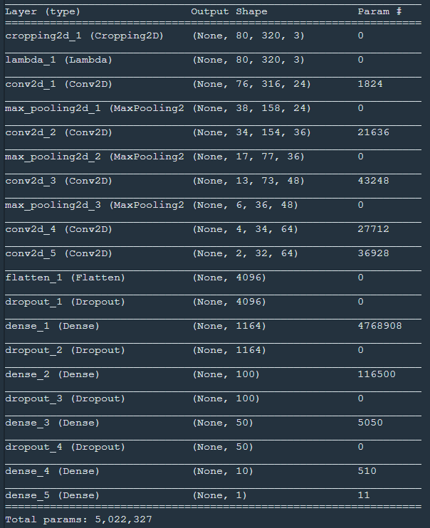
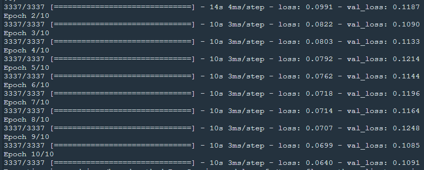

# **Behavioral Cloning** 

Author: Szabolcs Sergyan

In the project I had to take the following steps:

### 1. Generate training data in the Simulator
In the Simulator drive the car manually. The Simulator captures images frequently from a center, a left and a right camera fixed on the front of the car. When an image is captured the steering angle of the front wheels was also stored. These data is recorded in a CSV file.

### 2. Make distribution of steering angle close to uniform distribution
Using the CSV file the images and steering measurements can be loaded into the memory. The steering angle values fall into the range [-1.0, +1.0]. If we have a look at the histogram of steering angle values using 21 equal width histogram bins we get the following: [34, 26, 51, 54, 112, 125, 203, 204, 208, 221, **5559**, 70, 83, 70, 66, 58, 43, 41, 26, 25, 35]. Clearly the frequency of steering angles in the 11th bin is much higher than other ones. It is because steering angle 0 happens most frequently when we drive straight ahead.

I found that a distribution closer to uniform distribution can cause a better final result, so I ignored many cases of steering angle 0. I decreased the number of these cases by 95%, so only randomly selected 5% of straight drive was remaind after this preprocessing step. The updated histogram was the following: [34, 26, 51, 54, 112, 125, 203, 204, 208, 221, **331**, 70, 83, 70, 66, 58, 43, 41, 26, 25, 35].

### 3. Flip images horizontally
From the histogram that also can be seen the left turn is overestimated based on the stored data. To make a correction images can be flipped horizontally and measurements can be multiplied by -1 respectively.

Here you can see a sample image of training data set:



The flipped version of this image can be seen here:



### 4. Crop images

The top 60 and bottom 20 rows of images were cropped out. This way the most relevant part of the image (the road surface) remains only on the images.

Here is the cropped version of the previously shown image:



This preprocessing step was made by the model itself. Therefore when the model will be used later during testing, this step will be made automatically.

### 5. Normalize images

As the next step the model normalized the images from range [0, 255] to range [0, 1]. In order to use images with zero mean the intensity values of images were shifted by -0.5 to range [-0.5, +0.5].

It is worth mentioning in the model color images were used in RGB (exactly BGR, thanks to OpenCV) color space.

The normalization step was also made by the model.

### 6. Model architecture

The model developed by NVIDIA was used ([ref](https://developer.nvidia.com/blog/deep-learning-self-driving-cars/)). This model contains five convolutional layers and five fully connected layers.

Here you can see an overview of the model architecture created by my code:


1. The input of the model is image with shape 160x320x3, which measn 160 rows, 320 columns and 3 color channels.
2. The image is cropped and the shape is updated to 80x320x3.
3. The normalization step does not modify the image shape.
4. The first convolutional layer uses a kernel with size (5x5) and provides 24 output layers so the shape is updated to 76x316x24.
5. After the first convolutional layer max pooling was applied by size 2x2, so the output shape was 38x158x24.
6. The following convolutional layers take similar steps so I will not dive into it. That is worth mentioning the second and third convolutional layer use filter with size 5x5 and the fourth and fifth one 3x3, respectively. After the fourth and fifth layers no max pooling was applied.
7. At the end of the fifth convolutional layer the shape was 2x32x64.
8. After the convolutional layers the data was flattend to a vector with 4096 elements.
9. Before a fully connected layer was applied the data was dropped out using 75% as keeping probability. It helps us to avoid overfitting.
10. Then came 5 fully connected layers and drop out was used before the second and third layers as well.
11. At the end of the model only one value was the output which is really the steering angle for driving.

In the model the activation function was always the Relu function.

### 7. Training of the model

The model was trained by 80% of the data and 20% was used as validation set. These were selected randomly. Certainly at each epoch training data was shuffled.

As a loss function mean square error was used.

As an optimizer Adam was applied, so I did not have to select learning rate.

I used 10 epochs, and it was proved sufficent.

The loss of training and validation data can be seen in the following figure which was provided by the code:



Due to drop outs the model was not overfitted, the valuation loss was always more than training loss, and trainging loss was consecutively decreased.

The generated model is stored in ```model.h5``` file.

### 8. Test the model in the Simulator

The generated model was tested in the simulator, the result can be seen in ```video.mp4```.